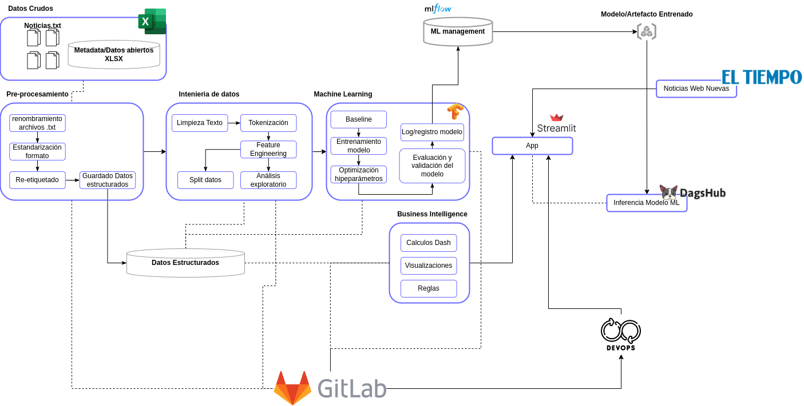

# Proyecto de NLP para la Identificación de Noticias Falsas Acerca de COVID-19
# Introducción


El programa de Ciencia de la Información, Bibliotecología y Archivística de la Pontificia Universidad Javeriana (CIBAR) se encuentra en un proceso de transformación que requiere la actualización de algunas líneas de trabajo disciplinar, entre las cuales se encuentra, la clasificación del conocimiento. La clasificación en su enfoque práctico ha sido un proceso natural y tradicionalmente manual, realizado por las unidades de información de las organizaciones, sin embargo, su efectividad está limitada por la minúscula capacidad de los seres humanos en relación al creciente volumen de datos e información, lo cual implica una demanda considerable de recursos y elevados costos para efectuar dicha actividad. En este sentido, es imperativo desarrollar sistemas inteligentes que permitan realizar la clasificación de información de forma semiautomática o automática, de tal manera que el profesional reciba un apoyo efectivo y pueda enfocar su labor a la supervisión y monitoreo. Uno de los casos de uso que se encuentra desarrollando el programa CIBAR, se enfoca en la clasificación automática de noticias sobre COVID-19, principalmente el reconocimiento de noticias falsas, que favorece la reivindicación del principio de veracidad, insumo en los procesos de comunicación y periodismo.

En cuanto a la orientació hacia el eje temátcio del COVID-19, es preponderante comprender el fenómeno desatado por este virus y su implicaciones; a finales de 2019 la información acerca del coronavirus irrumpió en el ámbito internacional describiendo la situación que se presentaba en China, no obstante, confirmada la propagación del virus fuera de las fronteras del país asiático y declarado el estado de alerta por parte de diversas naciones geograficamente distantes, los rumores y las noticias imprecisas se multiplicaron, mediado por la difusión en las redes sociales y los medios de comunicación.  

Dado que una parte de los usuarios de la información carece del conocimiento para estimar la veracidad de los hechos y los datos, al mismo tiempo que es imposble para el personal competente estar constantemente desmintiendo el amplio volumen de noticias que emergen sobre el tema, es necesario implementar un sistema que facilite la clasificación y el etiquetado de las noticias, estableciendo un filtro de la información previo a la publicación. El desarrollo de dicha solución tecnológica implica el uso de técncicas de procesamiento de lenguaje natural y Machine Learning, con el objetivo de modelar y entrenar un sistema para que de manera autónoma sea capaz de realizar la clasificación y permita el monitoreo del flujo de información asociado al tema.  

Con este es caso de uso se pretende consolidar una herramienta práctica para los procesos de clasificación de información y un insumo pedagógico útil para la formación de docentes y estudiantes de los programas de CIBAR y de comunicación social de la Faculta de Comunicación y Lenguaje de la Universidad Javeriana.  

## Descripción de la solución

El presente proyecto se enmarca en una macro categoría analítica: Clasificación, puesto que el elemento central del aplicativo analítico y una de las salidas puntuales se enfoca en determinar la clase correspondiente de cada una de las noticias asociadas a COVID-19, ya sea de carácter verídico o desinformativo. Por otro lado, el proceso para desarrollar dicha actividad de clasificación requiere de otras actividades analíticas asociadas al NLP, Natural Language Processing, como son el Text Mining y Deep Learning. Al inicio del ejercicio las fuentes de información proporcionan datos no estructurados, información escrita que demanda su transformación para obtener datos estructurados, esto con el objetivo de permitir la interpretación por parte de las máquinas y facilitar los análisis posteriores. 


Tarea analítica Fuente: Elaboración propia
El desarrollo de una tarea de clasificación entorno un problema de NPL, implica poder desarrollar correctamente:
*	Identificación de temas: Extracción y análisis de los principales tópicos mencionados en el conjunto de noticias. 
*	Extracción de información: Poder identificar y extraer información, patrones, comportamientos y/o posibles generalidades en los textos. Este punto también se clasifica elaboración de nubes de palabras, definición de hápax, entendimiento de palabras más comunes, entre otros.
*	Clasificación de texto: Categorización de las noticias en diferentes etiquetas según su tipo.
Las anteriores son tan solo algunas de las tareas a desarrollar y que se encuentran enmarcadas dentro de la tarea de clasificación. Aun así, dentro de su construcción, se encuentran una seria de ventajas y desventajas (que posteriormente toman el rol de retos) al momento de su aplicación. 
En relación con las ventajas, se destaca principalmente:
*	La posibilidad de determinar tendencias en los datos de las noticias que a priori y a simple vista no suelen ser evidentes.
*	Capacidad de automatización de tareas que hacen parte de NLP.
*	Capacidad de procesar importantes cantidades de texto de manera eficiente y rápida.
*	Dado el conjunto de datos inicial, se cuenta con la ventaja de no tener la necesidad de trabajar con múltiples idiomas puesto que las noticias se encuentran en español.

Ahora bien, algunas de las desventajas y/o potenciales retos se encuentran definidos por:
*	Sesgo del modelo: Teniendo en cuenta la primera fase, de recopilación de noticias. La mayoría de los problemas de NLP se encuentran expuestos a contener sesgos.
* Entendimiento de contexto: Los modelos de NLP en algunas ocasiones tienen dificultades para comprender correctamente el uso de una palabra según su contexto, por lo que algunas veces pueden inducir a un resultado impuntual.
### Objetivo General - Negocio

Desarrollar un modelo de clasificación automática de noticias asociadas a COVID-19 que facilite el proceso pedagógico de formación de los estudiantes y actualización de los docentes de la  Faculta de Comunicación y Lenguaje de la Universidad Javeriana.

### Objetivos Específicos - Negocio

- Describir las tecnicas analíticas de procesamiento de lenguaje natural y machine learning utilizadas para el proceso de clasificación de noticias.
- Listar los elementos característicos identificados en el proceso que permiten la segregación de noticias.
- Plantear un posible impacto social de los sistemas de clasificación de noticias.

### Objetivo General de Minería

Construir un modelo de clasificación de noticias asociadas a COVID-19 con metricas de desempeño superior a un clasificador ingenuo. Accuracy superior al 50%.

### Objetivos Específicos de Minería

- Explorar técnicas complementarias que permitan ampliar el volumen de información báse para el desarrollo del modelo.
- Implementar diversas tecnicas de procesamiento de lenguaje natural y machine learning en la construcción del modelo de clasificación.
- Superar en 10 puntos porcentuales un clasificador ingenuo.

# Arquitectura de la solución



# Estructura del proyecto


```
├── conf
├── dashboard
│  ├── app.py
│  ├── dash_data
│  │  ├── logistic_regression.pkl
│  │  ├── neural_network
│  │  │  ├── assets
│  │  │  ├── fingerprint.pb
│  │  │  ├── keras_metadata.pb
│  │  │  ├── saved_model.pb
│  │  │  └── variables
│  │  │     ├── variables.data-00000-of-00001
│  │  │     └── variables.index
│  │  └── processed_data_news.csv
│  ├── dash_functions.py
│  ├── Dockerfile
│  ├── LDA_fake.html
│  ├── LDA_true.html
│  ├── pipeline_dash_data_generation.py
│  └── pipeline_dash_models.py
├── data.dvc
├── datalab
│  ├── AnalisisExploratorio_Modelos_FakeNews.ipynb
│  ├── AnalisisExploratorioFakeNews.ipynb
│  ├── BASELINE_ml.ipynb
│  ├── feature_engineering.ipynb
│  ├── hyperparameter_optimization.ipynb
│  ├── mlflow_serving.ipynb
│  ├── pre-processing.ipynb
│  └── WebScrapping-Noticias-Fake.ipynb
├── deploy
├── docs
│  ├── DVC_DOCS.md
│  ├── experiment_tracking_DOCS.md
│  ├── img
│  │  ├── mlflow_pipeline.jpg
│  │  ├── pipeline_javeriana.png
│  │  └── sample_dash.png
│  ├── pipeline.md
│  ├── pipenv_DOCS.md
│  └── streamlit_dashboardDOCS.md
├── LICENSE
├── Pipfile
├── Pipfile.lock
├── README.md
├── requirements.txt
└── src
   ├── libs
   │  ├── __init__.py
   │  ├── configs.py
   │  ├── embeddings.py
   │  ├── mlflow_utils.py
   │  ├── nlp_package
   │  │  ├── README.md
   │  │  └── setup.py
   │  ├── topic_modeling.py
   │  └── utils.py
   ├── pipeline_preprocessing.py
   ├── pipeline_training_full.py
   └── tests

```

# Proceso de ejecución y despliegue

- El proceso de ejecución del pipeline se puede encontrar  [aquí](./docs/pipeline.md)
- El despliegue del dashboard está documentado [aquí](./docs/streamlit_dashboardDOCS.md)
# Requerimientos

   


Los modulos y versiones usadas se encuentran en los archivos `Pipfile` y `Pipfile.lock` 
# Errores conocidos

Sin errores conocidos por el momento
## Datos

| Nombre de la fuente | Descripción y características  |
| --------------------| -------------------------------|
| Noticas falsas | 296 archivos en formato .txt, individuales, nombrados con el titular de la noticia y cuya primera línea de contenido también incluye dicho texto.  |
| Noticias verídicas  | 237 archivos en formato .txt, individuales, nombrados con el titular de la noticia y cuya primera línea de contenido también incluye dicho texto.  |

## Resultados

[](https://colab.research.google.com/drive/1O0JwJDY9iK6ctFNng0v03WkwsSOSR3zo?usp=sharing)

# Maestría Analítica para la inteligencia de negocios
## Pontificia Universidad Javeriana
## Proyecto de Grado


## Integrantes Estudiantes

* David Rincón Piñeros
* Giovanni Jímenez Prieto
* Leonardo Restrepo Alvarez
* Miguel Arquez Abdala
