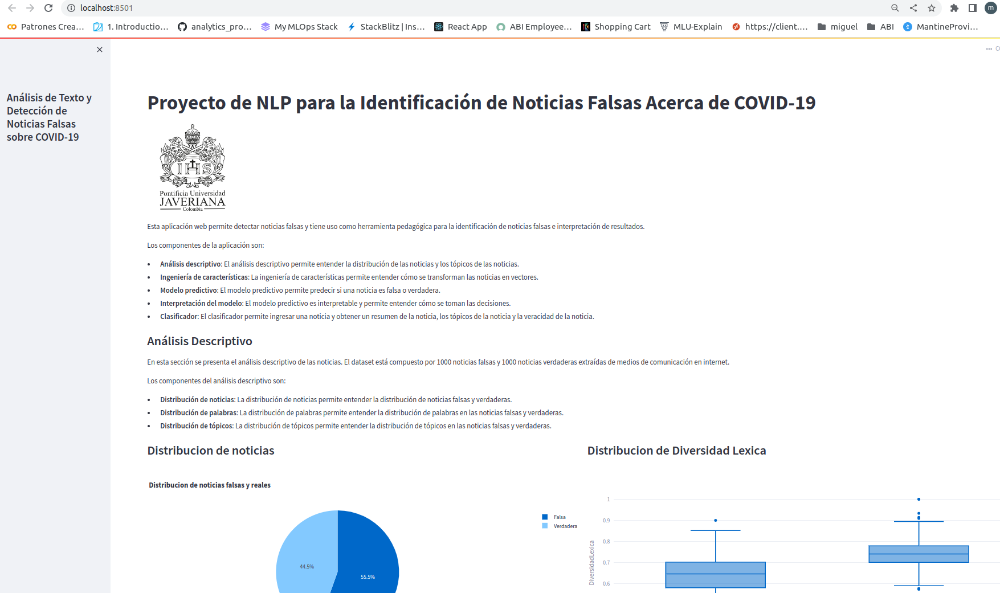

## Fakenews App


La aplicacion fue desarrollada con [Streamlit](https://docs.streamlit.io/) desplegada en el servidor de [Streamlit Cloud](https://streamlit.io/cloud)

La version productiva puede verse [aqui](https://abdala9512-fake-news-poc-dashboardapp-develop-lpmi7e.streamlit.app/)

## Despliegue en local

```
pipenv shell
streamlit run dashboard/app.py
```

Se abrira la aplicacion en `localhost:8501`


